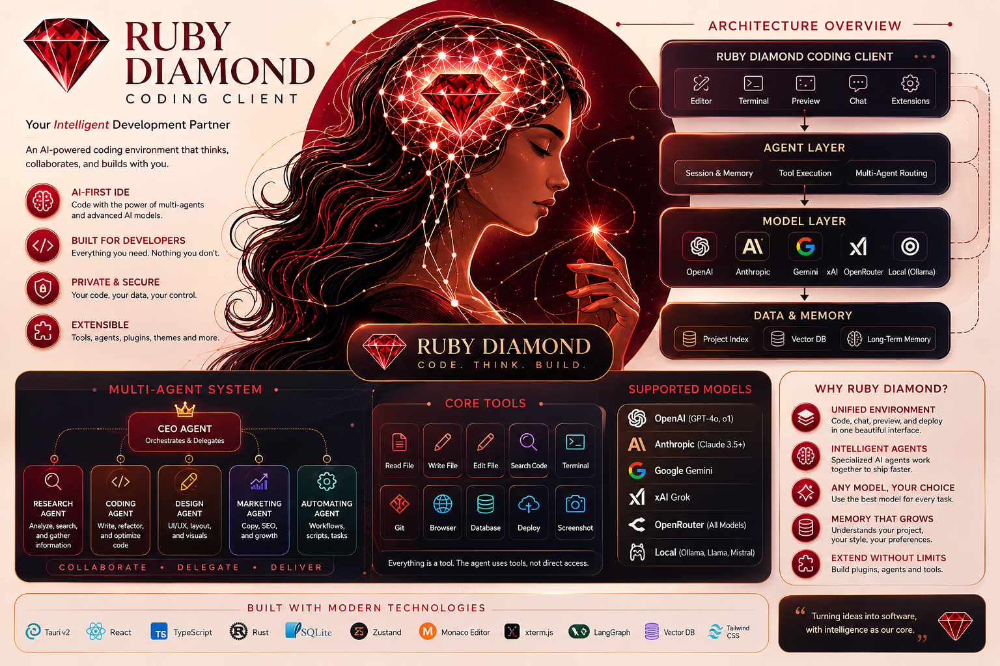

# Ruby Diamond v0.1.0

**AI-powered desktop IDE with autonomous agents, agent mesh, system monitoring, and persistent memory.**

Built with Tauri v2 (Rust + React/TypeScript), Ruby Diamond is a full-stack AI development environment that lets you create, configure, and run AI agents directly on your desktop — with real tool access, multi-agent debate protocols, local LLM support, and deep system integration.



---

## Features

### 1. Multi-Provider AI Agents
Create unlimited AI agents, each with its own:
- **LLM provider** — OpenAI, Anthropic, DeepSeek, Groq, xAI, OpenRouter, Cerebras, Mistral, Together, Fireworks, Ollama, llama.cpp, or any OpenAI-compatible endpoint
- **Model** — any model the provider offers (GPT-4, Claude, DeepSeek, MiMo, etc.)
- **Tool access** — each agent gets read_file, write_file, edit_file, bash, grep, glob, web_fetch, git tools
- **Conversation history** — full message log per agent

### 2. Agent Mesh (Multi-Agent Protocols)
Orchestrate multiple AI agents to collaborate on complex tasks:
- **Debate** — two agents propose and critique, a third judges
- **Review** — one agent works, another reviews the output
- **Ensemble** — multiple agents independently solve, results are synthesized
- **Custom roles** — Proposer, Critic, Synthesizer, Executor

### 3. Local LLM (llama.cpp)
Manage and run local models through llama.cpp:
- Discover GGUF/GGML models from common locations
- Start/stop the llama.cpp server with a click
- Route agents through local models for offline, private inference
- Supported: Llama 3, Mistral, Gemma, Phi, DeepSeek GGUF models

### 4. Honcho Memory
Persistent agent memory and peer modeling via Honcho:
- Create agent identities (peers) with roles and descriptions
- Sessions track agent interactions with full message history
- Memory retrieval for long-term context retention
- Configurable API endpoint and auth

### 5. Plugin Marketplace
Extend functionality with installable plugins:
- Browse remote plugin registries
- Install plugins from URLs, git repos, or local paths
- Skills system — load SKILL.md-based knowledge and workflows
- Built-in skills: code-review, project-bootstrap, rust-analyzer

### 6. System Monitor
Real-time Linux system monitoring:
- CPU usage (overall + per-core) with brand name
- RAM/Swap usage with live gauges
- Disk usage per mount point with filesystem type
- Process list with CPU, memory, runtime
- Network interface statistics
- Temperature sensors
- Customizable gauge colors and polling interval
- Browser fallback with demo data

### 7. System Admin AI Agent
Dedicated DeepSeek-powered system administrator:
- Check system health, disk usage, running services
- Run `dnf update`, `flatpak update`, cleanup commands
- Monitor SELinux status, firewall, failed logins
- Interactive terminal with bash access
- Proactive maintenance suggestions

### 8. Code Editor & File Explorer
Full-featured code editing:
- CodeMirror 6 editor with syntax highlighting
- Multi-language support: JavaScript, TypeScript, Python, Rust, HTML, CSS, JSON, Markdown
- Tabbed file management
- File tree explorer with directory navigation
- xterm.js terminal emulator built in

### 9. Browser Mode
When not running as a Tauri desktop app, Ruby Diamond falls back gracefully:
- Browser-based agent chat via direct API calls (Anthropic-compatible, OpenAI-compatible)
- Mock system stats for development/demo
- Full UI in any modern browser at http://localhost:1420

---

## Quick Start

### Prerequisites
- **Node.js** 18+ and **pnpm** (or npm)
- **Rust** toolchain (rustc 1.75+, cargo)
- Linux: `webkit2gtk4.1-devel`, `gtk3-devel`, `libappindicator-gtk3-devel` (see `setup.sh`)

### Install & Run

```bash
# Clone
git clone https://github.com/milodule3-debug/ruby-diamond-client.git
cd ruby-diamond-client

# Install JS deps
pnpm install

# Desktop app (Tauri)
pnpm tauri dev

# Or just the web UI (browser only, no desktop features)
pnpm dev

# Flask backend (optional — NVIDIA API chat)
pip install -r requirements.txt
export NVIDIA_API_KEY="nvapi-..."
python app.py
```

The app opens at **http://localhost:1420** (web) or as a native window (Tauri).

### First Run
1. The splash screen appears — press **Enter** or wait 10 seconds
2. A default **Ruby** agent is auto-created (MiMo-V2.5-Pro)
3. The sidebar (left) gives you access to all panels
4. Click **Chat** to start talking to your agent
5. Click **System Admin** to run `check system health`

---

## Architecture

```
ruby-diamond-client/
├── src/                          # React frontend (TypeScript)
│   ├── components/
│   │   ├── Splash.tsx            # Animated splash screen
│   │   ├── Sidebar.tsx           # Icon-based navigation
│   │   ├── Explorer.tsx          # File tree browser
│   │   ├── Editor.tsx            # CodeMirror code editor
│   │   ├── Terminal.tsx          # xterm.js terminal
│   │   ├── Chat.tsx              # Agent chat interface
│   │   ├── AgentTabs.tsx         # Multi-agent tab management
│   │   ├── MeshPanel.tsx         # Agent mesh (debate/review/ensemble)
│   │   ├── LlamaPanel.tsx        # Local LLM management
│   │   ├── MemoryPanel.tsx       # Honcho memory viewer
│   │   ├── PluginPanel.tsx       # Plugin marketplace
│   │   ├── SystemPanel.tsx       # System monitor dashboard
│   │   └── SysAdminPanel.tsx     # DeepSeek system admin agent
│   ├── lib/
│   │   ├── api.ts                # Tauri invoke types
│   │   ├── agent.ts              # Agent management
│   │   └── provider.ts           # LLM provider selection
│   ├── store.ts                  # Zustand global state
│   ├── styles.css                # Design system + components
│   └── main.tsx                  # React entry point
│
├── src-tauri/                    # Rust backend
│   └── src/
│       ├── main.rs               # Tauri entry point
│       ├── lib.rs                # AppState, plugin registration, invoke handler
│       ├── types.rs              # Shared types (ToolDef, Message, AgentState, etc.)
│       ├── commands.rs           # Tauri commands (list_tools, create_agent, run_agent, read_dir, etc.)
│       ├── system/mod.rs         # System monitor (CPU, RAM, disk, processes, network, temps)
│       ├── agent/mod.rs          # Agent loop (plan → tool calls → observe → replan)
│       ├── llm/mod.rs            # LLM provider trait + OpenAI-compatible implementation
│       ├── tools/
│       │   ├── mod.rs
│       │   ├── registry.rs       # Tool registry with parallel execution
│       │   └── builtin.rs        # Built-in tools (read/write/edit file, bash, grep, glob, web_fetch, git)
│       ├── skills/mod.rs         # Skill engine (SKILL.md loading/parsing)
│       ├── mesh/mod.rs           # Agent mesh orchestrator (debate, review, ensemble)
│       ├── memory/mod.rs         # Honcho client (peers, sessions, messages, stats)
│       ├── llamacpp/mod.rs       # Local llama.cpp manager (discover, start, stop)
│       └── plugins/mod.rs        # Plugin marketplace (registry, install, list)
│
├── skills/                       # Built-in skills (SKILL.md format)
├── app.py                        # Optional Flask backend (NVIDIA API)
├── setup.sh                      # Linux system dependencies
└── vite.config.ts                # Vite dev server config
```

---

## Panels Overview

| Icon | Panel | Description |
|------|-------|-------------|
| 💬 | Chat | Talk to your AI agent, run goals, see tool calls |
| 🧠 | Agent Mesh | Multi-agent debate/review/ensemble protocols |
| ⚙️ | Local LLM | llama.cpp server management & model discovery |
| 📦 | Plugins | Plugin marketplace & skill browser |
| 🗄️ | Memory | Honcho memory browser (peers, sessions, messages) |
| 📊 | System Monitor | Real-time CPU/RAM/disk/process/network gauges |
| 🛡️ | System Admin | DeepSeek-powered system admin with bash access |

---

## Configuration

### Environment Variables
| Variable | Description | Default |
|----------|-------------|---------|
| `HONCHO_API_KEY` | Honcho memory API key | (none) |
| `NVIDIA_API_KEY` | NVIDIA API key (for Flask backend) | (none) |
| `NVIDIA_MODEL` | NVIDIA model override | `meta/llama-3.1-8b-instruct` |

### LLM Providers
Agents support any OpenAI-compatible provider. Configure per-agent:
```typescript
{
  provider: "openai" | "anthropic" | "deepseek" | "groq" | "xai" |
            "openrouter" | "cerebras" | "mistral" | "together" |
            "fireworks" | "ollama" | "llamacpp",
  model: string,
  api_key?: string,
  base_url?: string,
  max_tokens: number,
  temperature: number
}
```

Default provider URLs are auto-configured — set `base_url` for custom endpoints.

### Plugins & Skills
Skills are `SKILL.md` files in `skills/` or `~/.ruby-diamond/skills/`. Format:
```markdown
---
name: my-skill
description: My custom skill
---

# Instructions
...
```

---

## Development

```bash
# Watch mode (Vite hot reload + Tauri)
pnpm tauri dev

# Build production desktop app
pnpm tauri build

# Lint & type-check
pnpm tsc
```

---

## License

MIT © Ruby Diamond Team
